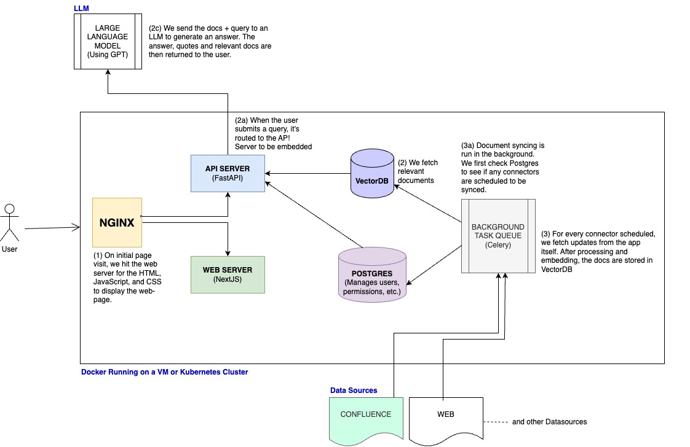

# PayserAi (v0.3):
<h4>Paysera-Ai: Real-time Q/A using LLM for labeled Confluence pages & Multiple DataSources</h4>
Paysera-ai is an enterprise question-answering system that allows users to ask natural language questions against internal documents and receive reliable answers. These answers are backed by quotes and references from the source material, ensuring trustworthiness.The application aims to bridge the gap between static Confluence content and dynamic user queries. By leveraging advanced language models and vector similarity search, the application provides real-time, contextually relevant answers to user questions based on the updated content stored in Confluence.


 

## Features:

- Dynamic QA: Provides answers to user queries using the content indexed from Confluence.
- Extract, Embedding and indexing according to filter of labeled pages in Confluence pages using CQL.
- Using Update version of labeled confluence pages.(if page is updated or changed the answer will be updated version of contents)
- Real-time Indexing: Automatic syncing and re-indexing ensure that the chatbot's answers are always based on the latest content.
- Integration with Vector Stores: The application leverages vector similarity search for efficient and accurate retrieval of answers.
- Access Management and User management: Includes user authentication via your google account.
- Secure Access: Ensures that only authorized users can access and configure the chatbot.
- Custom Assistans to be able to customize and define your own prompt. for example anser your question in Lithuanian, or explain your question like five years old.
- Advanced UI/UX.
- Admin Panel to config and monitor everything.(shows the last update time and number of document or pages that added)
- LLM Support: Compatible with various LLMs like GPT4.
- Admin Dashboard: For managing connectors and setting up features like live update fetching.(shows the last update time and number of document or pages that added)
- Deployment: Supports Docker Compose and Kubernetes deployment.
<br><br>


<br><br>

# To build the containers from source and start Payserai:
#### start
- ```docker compose -f docker-compose.dev.yml -p payserai-stack up  --build --force-recreate```
#### stop
- ```docker compose -f docker-compose.dev.yml -p payserai-stack down -v```
- ```-v``` at the end to delete the volumes


Bring up your docker engine and run:
- Setup your .env files
- Make a copy of env.prod.template called .env (cp env.prod.template .env)
- Fill in any relevant env variables to your setup, and delete the rest.
- Make a copy of env.nginx.template called .env.nginx (cp env.nginx.template .env.nginx)
- Fill in the DOMAIN variable with the domain that people will use internally to access the Payserai UI

- EMAIL is optional
- Run ./init-letsencrypt.sh to get a SSL certificate from LetsEncrypt.


<br><br>

# Deploying Payserai (Docker)

## Docker Compose:

Requirements: Docker and docker compose

1. To run Payserai, navigate to `docker_compose` directory and run the following:
   
      - `docker compose -f docker-compose.dev.yml -p payserai-stack up -d --build --force-recreate`
to build from source
  

2. To shut down the deployment, run:
   - To stop the containers: `docker compose -f docker-compose.dev.yml -p payserai-stack stop`
   - To delete the containers: `docker compose -f docker-compose.dev.yml -p payserai-stack down`


3. To completely remove payserai run:
   - **WARNING, this will also erase your indexed data and users**
   - `docker compose -f docker-compose.dev.yml -p payserai-stack down -v`


Additional steps for user auth and https if you do want to use Docker Compose for production:

1. Set up a `.env` file in this directory with relevant environment variables.
   - Refer to `env.prod.template`
   - To turn on user auth, set:
     - GOOGLE_OAUTH_CLIENT_ID=\<your GCP API client ID\>
     - GOOGLE_OAUTH_CLIENT_SECRET=\<associated client secret\>
     - Refer to https://developers.google.com/identity/gsi/web/guides/get-google-api-clientid

2. Set up https:
   - Set up a `.env.nginx` file in this directory based on `env.nginx.template`.
   - `chmod +x init-letsencrypt.sh` + `./init-letsencrypt.sh` to set up https certificate.

3. Follow the above steps but replacing dev with prod.


<br>

 # Deploying Payserai (K8s)
 <h3>Build Backend images</h3>

```docker build -t payserai/payserai-backend:latest -f Dockerfile .```

 <h3>Build Frontend images</h3>

```docker build -t payserai/payserai-web-server:latest -f Dockerfile .```

<h3>Apply manifests</h3>

```minikube kubectl -- apply -f k8s/deployment.yaml```

```minikube kubectl -- apply -f k8s/service.yaml```

```minikube kubectl -- apply -f k8s/ingress.yaml```
